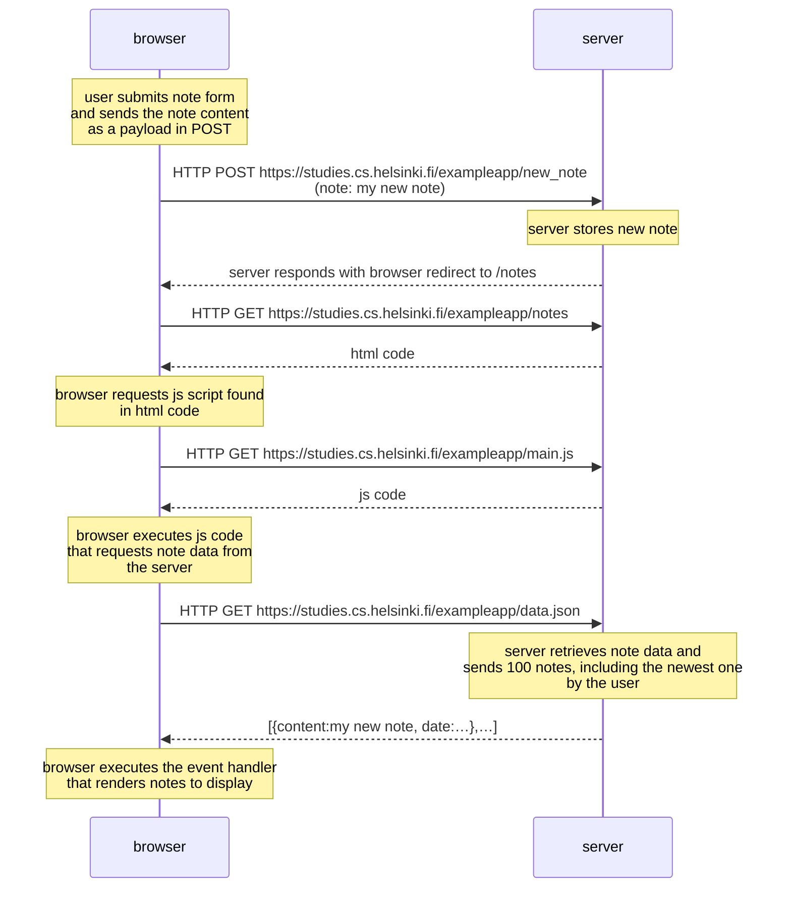

```mermaid
sequenceDiagram
note over browser: user submits note form<br>and sends the note content<br>as a payload in POST
browser->>server: HTTP POST https://studies.cs.helsinki.fi/exampleapp/new_note<br>(note: my new note)
note over server: server stores new note
server-->>browser: server responds with browser redirect to /notes
browser->>server: HTTP GET https://studies.cs.helsinki.fi/exampleapp/notes
server-->>browser: html code
note over browser: browser requests js script found<br>in html code
browser->>server: HTTP GET https://studies.cs.helsinki.fi/exampleapp/main.js
server-->>browser: js code
note over browser: browser executes js code<br>that requests note data from<br> the server
browser->>server: HTTP GET https://studies.cs.helsinki.fi/exampleapp/data.json
note over server: server retrieves note data and<br>sends 100 notes, including the newest one<br>by the user
server-->>browser: [{content:my new note, date:…},…]
note over browser: browser executes the event handler<br>that renders notes to display
```