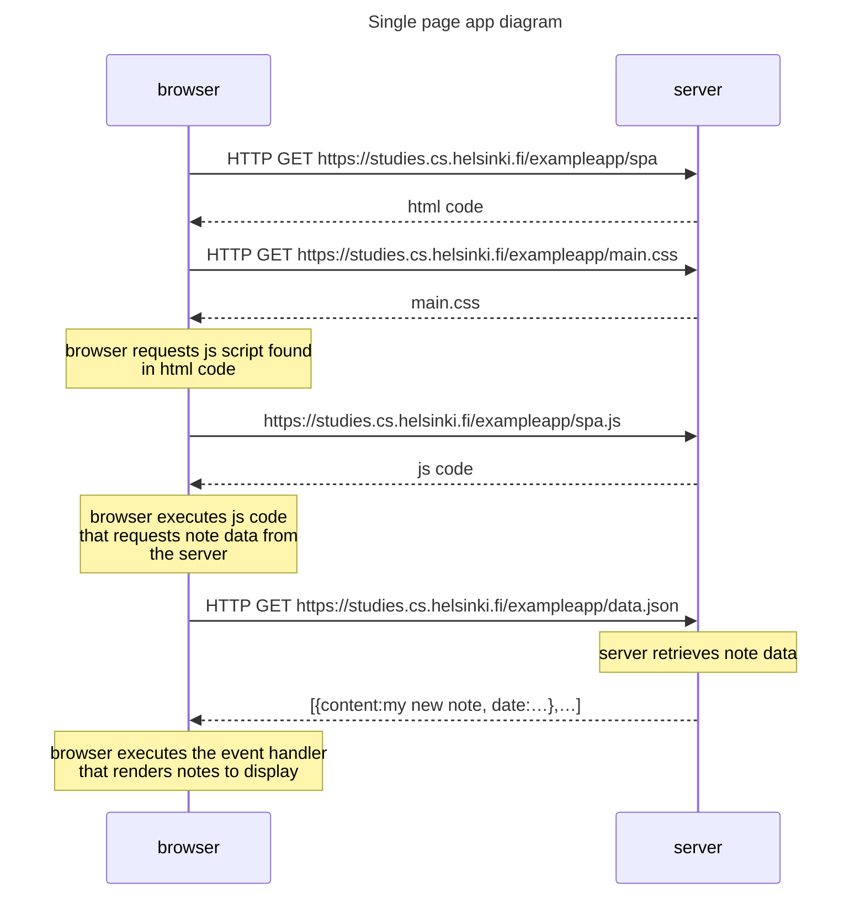

```mermaid
sequenceDiagram title Single page app diagram
browser->>server: HTTP GET https://studies.cs.helsinki.fi/exampleapp/spa
server-->>browser: html code
browser->>server: HTTP GET https://studies.cs.helsinki.fi/exampleapp/main.css
server-->>browser: main.css
note over browser: browser requests js script found<br>in html code
browser->>server: https://studies.cs.helsinki.fi/exampleapp/spa.js
server-->>browser: js code
note over browser: browser executes js code<br>that requests note data from<br> the server
browser->>server: HTTP GET https://studies.cs.helsinki.fi/exampleapp/data.json
note over server: server retrieves note data
server-->>browser: [{content:my new note, date:…},…]
note over browser: browser executes the event handler<br>that renders notes to display
```