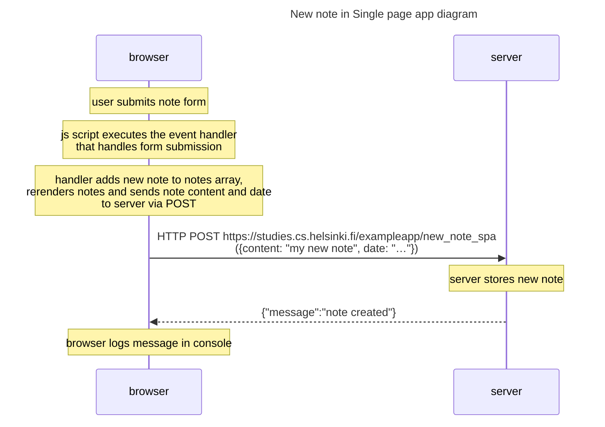

```mermaid
sequenceDiagram title New note in Single page app diagram
note over browser: user submits note form
note over browser: js script executes the event handler<br>that handles form submission
note over browser: handler adds new note to notes array,<br> rerenders notes and sends note content and date<br>to server via POST
browser->>server: HTTP POST https://studies.cs.helsinki.fi/exampleapp/new_note_spa<br>({content: "my new note", date: "…"})
note over server: server stores new note
server-->>browser: {"message":"note created"}
note over browser: browser logs message in console
```